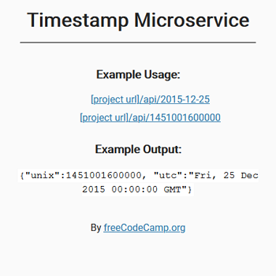

# FreeCodeCamp - Backend Challenges - Timestamp Microservice

This is a solution to the [Timestamp Microservice](https://www.freecodecamp.org/learn/back-end-development-and-apis/back-end-development-and-apis-projects/timestamp-microservice) course on [FreeCodeCamp](https://www.freecodecamp.org/).

## Table of contents

- [Overview](#overview)
  - [The challenge](#the-challenge)
  - [Screenshot](#screenshot)
  - [Links](#links)
- [My process](#my-process)
  - [Built with](#built-with)
  - [How to install and run](#how-to-install-and-run)
- [Author](#author)
- [License](#license)

## Overview

### The challenge

"Build a full stack JavaScript app that is functionally similar to this: https://timestamp-microservice.freecodecamp.rocks."

### Screenshot



### Links

- Code URL: [Github](https://github.com/cekstedt/FreeCodeCamp-Timestamp-Microservice)
- Live Site URL: [Glitch](https://comet-satisfying-judo.glitch.me/)
- Challenge URL: [FreeCodeCamp](https://www.freecodecamp.org/learn/back-end-development-and-apis/back-end-development-and-apis-projects/timestamp-microservice)

## My process

### Built with

- NodeJS
- Express

### How to install and run

Make sure you have node.js installed.
```
node -v
```

Clone into the repo.
```
git clone https://github.com/cekstedt/FreeCodeCamp-NPM
```

Navigate into the root project folder and install dependencies.
```
cd FreeCodeCamp-Timestamp-Microservice/
npm install
```

Lastly, run the command `npm run start` to start the server, then navigate to http://localhost:3000/ (when developing locally).

## Author

- FreeCodeCamp - [@cekstedt](https://www.freecodecamp.org/cekstedt)

## License

- FreeCodeCamp material is licensed under the [BSD-3-Clause](https://github.com/freeCodeCamp/freeCodeCamp/blob/main/LICENSE.md) license.
